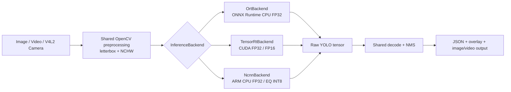
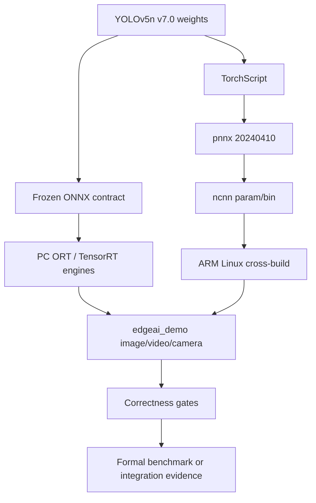

# EdgeAI Deploy Benchmark

一个面向端侧 AI 部署的 YOLOv5n v7.0 工程：同一套 C++ 推理接口贯通
ONNX Runtime、TensorRT/CUDA 和 ARM Linux ncnn，并在真实 Anlogic DR1M90
开发板上完成 CPU、INT8、UVC 摄像头和 vendor NPU control 验证。

项目重点不是“只跑通模型”，而是把模型契约、预处理、后处理、正确性、
性能边界、交叉编译、动态库和板端证据全部冻结成可复核的部署链路。

## Project Highlights

- 固定 YOLOv5n v7.0：batch=1，输入 `[1,3,640,640]`，输出
  `[1,25200,85]`，FP32、无图内 NMS。
- C++17、OpenCV、ONNX Runtime、TensorRT、ncnn 共用 letterbox、decode/NMS
  和可视化逻辑；backend 不可用时显式报错，不静默 fallback。
- PC：CPU ORT 与 RTX 4060 Ti TensorRT FP32/FP16；ARM：AArch64 ncnn
  FP32 与 EQ INT8。
- DR1 实机：Linux 6.1.111-rt42、V4L2 UVC camera、ncnn INT8、视频文件和
  vendor `Alnpu | ALHardNPU` face control。
- 正式结果只来自 [Task040 authoritative manifest](results/final/authoritative_results.json)。

## Architecture



The backend boundary is intentionally small: adapters return raw model output,
while preprocessing, postprocessing and visualization remain backend-independent.

## Deployment Pipeline



Build and runtime identities are kept separate from generated binaries. Large
models, engines, SDKs, rootfs images and board packages remain external.

## Backend Matrix

| Backend | Platform | Model / precision | Status | Scope |
|---|---|---|---|---|
| ONNX Runtime | PC CPU | YOLOv5n FP32 | `YOLOV5N_CPU_FORMAL_READY` | Formal benchmark |
| TensorRT / CUDA | RTX 4060 Ti | YOLOv5n FP32 + FP16 | `TENSORRT_FP32_FP16_FORMAL_READY` | Formal benchmark; FP16 COCO gate passed |
| ncnn | DR1 Cortex-A35-class CPU | YOLOv5n FP32 + EQ INT8 | `NCNN_FP32_EQ_INT8_FORMAL_READY` | Formal benchmark; EQ accepted |
| Alnpu \| ALHardNPU | DR1 NPU | Vendor face model | `FUNCTIONAL_CONTROL_ONLY` | NPU functional control, no YOLO speed claim |
| Alnpu | DR1 NPU | Custom YOLOv5n | `WAITING_FOR_VENDOR_INPUT` | Not benchmarked; no CPU fallback |

## Final Benchmark

These are independent formal rows. They are not a cross-hardware speedup claim.
Pipeline includes the recorded preprocess, backend and postprocess stages.

| Platform / backend | Precision | Backend-call mean (ms) | Pipeline mean (ms) | FPS | Peak RSS |
|---|---:|---:|---:|---:|---:|
| PC CPU ORT | FP32 | 45.849137 | 51.802986 | 19.303907 | 150869 KiB |
| RTX 4060 Ti TensorRT | FP32 | 3.712445 | 9.283727 | 107.715355 | 537596 KiB |
| RTX 4060 Ti TensorRT | FP16 | 3.716104 | 9.408935 | 106.281952 | 548172 KiB |
| DR1 ncnn | FP32 | 1882.246418 | 1973.145698 | 0.506805 | 166579 KiB |
| DR1 ncnn | EQ INT8 | 1173.207637 | 1266.499601 | 0.789578 | 149047 KiB |

TensorRT also records a separate CUDA execution event: FP32 **1.674261 ms**
versus FP16 **1.370379 ms** (`1.221751x`). This event covers `enqueueV3` only;
the backend-call wall boundary includes H2D, execution, D2H and synchronization.
FP16 therefore improves GPU execution but not end-to-end pipeline time. Task038
unified-app timings and Task039 video/camera timings are integration evidence,
not rows in this table.

## Accuracy / Performance Trade-off

| Platform comparison | Accuracy reference → candidate | Absolute delta | Accepted performance result |
|---|---|---|---|
| DR1 ncnn FP32 → EQ INT8 | mAP50 `0.457605 → 0.443309`; mAP50-95 `0.279777 → 0.265115` | `-0.014296 / -0.014662` | Accuracy gate PASS; inference `1.604359x`, pipeline `1.557952x`, FPS `+55.795208%`, RSS reduction `10.417162%` |
| TensorRT FP32 → FP16 | mAP50 `0.448303 → 0.448105`; mAP50-95 `0.274720 → 0.274787` | `-0.000197 / +0.000066` | COCO gate PASS; GPU execution `1.221751x`; pipeline does not improve |

COCO evaluation used independent held-out data and the frozen evaluator. The
deployment output contract remains confidence `0.25`, NMS IoU `0.45`; evaluation
thresholds are not changed to rescue a backend.

## ARM Optimization

The DR1 CPU story is deliberately measurable:

1. Runtime tuning selected ncnn OpenMP with `threads=2`, default scheduling and
   packing on.
2. Layer profiling found convolution responsible for **80.304%** of layer time;
   inference accounts for **95.40%** of the FP32 pipeline.
3. ncnn official EQ INT8 was calibrated on 500 COCO images and evaluated on 4500
   disjoint images. It passed the `0.02` mAP50/mAP50-95 gate and delivered the
   accepted speed and memory improvements above.

## TensorRT Optimization

CUDA 12.9 and TensorRT 10.13.3 were installed toolkit-only in WSL2; no Linux
NVIDIA display driver was replaced. Engines were built on the RTX 4060 Ti and
checked against the same preprocessing, decode/NMS and COCO correctness gate.
FP16 preserves accuracy, accelerates the GPU execution region, and exposes the
next bottleneck: host preprocessing, transfers, synchronization and postprocess.

## DR1 Camera Demo

`edgeai_demo` accepts image, video and camera sources through the same backend
factory. The real DR1 UVC run used `/dev/video0`, Sonix USB 2.0 Camera,
`uvcvideo`, V4L2 YUYV `640x480@25 FPS`, ncnn EQ INT8, and a bounded synchronous
run: `captured=3`, `processed=3`, `written=3`, `exit=0`. Mean inference was
`1343.185 ms`, pipeline `1725.077 ms`, effective processing FPS `0.564866`.

This is **camera integration evidence**, not a realtime camera benchmark:
`queue capacity=0`, and `dropped=0` only describes that bounded serialized run.
The output video was re-decoded successfully. See
[Task039 evidence](results/evidence/039/dr_camera_ncnn_int8.json) and the
[presentation/demo plan](docs/PROJECT_PRESENTATION.md).

## DR1 NPU Enablement

The vendor face control is a real DR1 deployment closed loop:

- vendor face input → Arm NN → `Alnpu | ALHardNPU` → output/visualization;
- CPU fallback was disabled and no `CpuAcc`/`CpuRef` result was accepted;
- it is a different model, not a YOLOv5n performance result.

The custom YOLOv5n NPU path remains `WAITING_FOR_VENDOR_INPUT`. The audited
runtime's generic Alnpu graph boundary and the missing vendor deployment chain
are documented in the [vendor handoff](docs/vendor_handoff/dr1m90_npu/README.md).

## Quick Start

The generated model assets are intentionally Git-ignored. Supply the frozen
model and matching local runtime roots, then build a Release C++ application:

```bash
export ONNXRUNTIME_ROOT=/path/to/onnxruntime-linux-x64-1.18.1
export NCNN_ROOT=/path/to/ncnn-linux-x64-20240410-local
cmake -S cpp -B build/pc-acceptance-release -G Ninja \
  -DCMAKE_BUILD_TYPE=Release \
  -DONNXRUNTIME_ROOT="$ONNXRUNTIME_ROOT" \
  -DNCNN_ROOT="$NCNN_ROOT"
cmake --build build/pc-acceptance-release --parallel
ctest --test-dir build/pc-acceptance-release --output-on-failure
```

Single image with ORT:

```bash
./build/pc-acceptance-release/edgeai_demo \
  --backend ort --precision fp32 \
  --model models/yolov5n-v7.0/yolov5n.onnx \
  --manifest models/yolov5n-v7.0/manifest.json \
  --source data/samples/images/pc_reference.jpg \
  --output-image build/reproduction/ort.png \
  --output-json build/reproduction/ort.json
```

TensorRT uses a locally built engine:

```bash
./build/pc-acceptance-release/edgeai_demo \
  --backend tensorrt --precision fp16 \
  --model /path/to/yolov5n_fp16.engine \
  --source data/samples/images/pc_reference.jpg \
  --output-image build/reproduction/trt.png \
  --output-json build/reproduction/trt.json
```

Video and camera use the same interface:

```bash
./build/pc-acceptance-release/edgeai_demo \
  --backend tensorrt --precision fp16 --model /path/to/engine \
  --source data/samples/videos/pc_reference.mp4 \
  --output-video build/reproduction/result.avi --output-json build/reproduction/video.json

./build/pc-acceptance-release/edgeai_demo \
  --backend ncnn --precision int8 --model /path/to/eq-int8-manifest \
  --camera 0 --max-frames 10 \
  --output-video build/reproduction/camera.avi --output-json build/reproduction/camera.json
```

For DR1, use the approved external EQ INT8 ncnn manifest/param/bin and the
`recommended-dual-thread` profile (`threads=2`, OpenMP, packing on). The CLI
never relabels FP32 assets as INT8 and never falls back to another backend.

## Repository Structure

```text
cpp/                 C++17 common pipeline and backend adapters
python/              ORT reference utilities and evaluator helpers
configs/             Frozen model/inference contracts
models/              Small manifests; generated model binaries stay ignored
docs/                Benchmark, deployment and presentation documentation
results/final/       Task040 authoritative results and validation
results/evidence/    Task-specific structured evidence
tasks/               Task state and execution records
tests/python/        Offline validators and focused tests
```

## Reproducibility / Evidence

- [Authoritative results manifest](results/final/authoritative_results.json)
- [README-ready frozen tables](results/final/README_READY_TABLES.md)
- [Final provenance report](docs/FINAL_BENCHMARK_RESULTS.md)
- [Model contract](docs/model_contract.md)
- [PC benchmark methodology](docs/benchmark_methodology.md)
- [ARM profiling and INT8 reports](docs/benchmark/ARM_CPU_PERFORMANCE_OPTIMIZATION.md)
- [TensorRT report](docs/benchmark/TENSORRT_DEPLOYMENT_BASELINE.md)
- [DR1 camera evidence](results/evidence/039/validation.json)
- [Vendor NPU handoff](docs/vendor_handoff/dr1m90_npu/README.md)

The Task040 validator re-hashes every source evidence file used by the final
manifest. Reproduction commands, model SHA256 values and deployment identities
are documented without committing proprietary SDKs, engines, models, private
keys or large logs.

## Known Limitations

- Formal numbers are per-platform rows; no cross-hardware speedup is claimed.
- Task038/039 timings are integration evidence, not formal video or camera
  throughput benchmarks.
- DR1 ncnn is CPU-only; the accepted EQ INT8 result is not an NPU result.
- The DR1 custom YOLOv5n NPU path awaits a vendor-compatible generic graph
  backend, native compiler/runtime, or official GEG400 YOLO deployment chain.
- The vendor face NPU control does not establish YOLOv5n NPU support.
- Generated ONNX, ncnn param/bin, TensorRT engines, SDKs and board images must
  be supplied from the recorded external sources.

For the concise architecture, recording script, shot list and approved visual
assets, see [PROJECT_PRESENTATION.md](docs/PROJECT_PRESENTATION.md).
