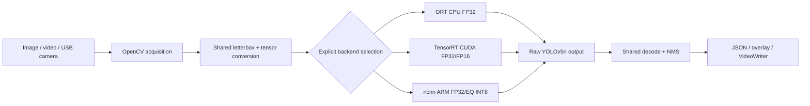

# Project Presentation Pack

This is the presentation companion to the concise README.  It is a recording
plan, not a new benchmark campaign.  Every measured number belongs to the
Task040 manifest; Task038/039 timings remain integration-only.

## README-ready architecture



The vendor face control is intentionally outside this YOLOv5n adapter graph:
it is a separate `Alnpu | ALHardNPU` functional deployment path with its own
model contract.

## README-ready deployment flow

```mermaid
flowchart TD
    M[YOLOv5n v7.0 weights + frozen SHA256] --> O[FP32 ONNX\n[1,3,640,640] -> [1,25200,85]]
    O --> R[ORT correctness reference]
    O --> T[TensorRT engine build\nFP32 / FP16]
    M --> P[TorchScript + pnnx 20240410]
    P --> N[ncnn param/bin]
    N --> A[AArch64 cross-build\nOpenMP + packing]
    R --> G[Golden / COCO evaluator]
    T --> G
    A --> G
    G --> Z[Formal result or scoped integration evidence]
```

## One-to-two-minute demo script

The script below is designed for a silent screen recording with short voiceover
or captions.  It does not require a new board run.

| Time | Shot | Narration / caption | Evidence to show |
|---:|---|---|---|
| 0–8 s | Title and contract | “EdgeAI Deploy Benchmark: one YOLOv5n contract across PC and ARM.” | README title; model contract link |
| 8–20 s | Architecture diagram | “OpenCV acquisition and decode/NMS are shared; only the inference adapter changes.” | README Mermaid diagram |
| 20–38 s | PC TensorRT image/video | “The RTX 4060 Ti runs TensorRT FP16 with COCO-gated accuracy.” | TensorRT overlay; final table |
| 38–58 s | DR1 CPU comparison | “On real DR1 hardware, EQ INT8 preserves the defined accuracy gate and cuts CPU inference time.” | DR1 trade-off row; ARM profile |
| 58–75 s | DR1 camera | “The same C++ pipeline accepts V4L2 camera frames and writes an annotated video.” | Three-frame camera evidence and output video |
| 75–92 s | NPU control | “A vendor face model reaches `Alnpu | ALHardNPU` with CPU fallback disabled.” | Face annotated frame and assignment log |
| 92–108 s | Honest boundary | “Custom YOLOv5n NPU is waiting for vendor graph/runtime support; it is not presented as a result.” | Backend matrix and limitation note |
| 108–120 s | Reproducibility | “Hashes, protocols and source evidence are machine-validated in Task040.” | `authoritative_results.json` and provenance report |

Recommended voiceover: explain the engineering decisions, not a list of task
numbers.  Keep the final frame on the backend matrix so the NPU scope is clear.

## Demo recording shot list

| ID | Capture | Include | Avoid |
|---|---|---|---|
| S1 | README top section | Project purpose, architecture, final table | Long task history |
| S2 | `edgeai_demo --backend tensorrt` image or video output | Overlay, backend and precision labels | Unmeasured FPS claims |
| S3 | Final ARM trade-off table | FP32→EQ INT8 mAP and speed numbers | Cross-hardware speedup language |
| S4 | DR1 camera representative frame | `/dev/video0`, V4L2 context, annotated output | Calling 0.564866 FPS realtime |
| S5 | NPU face control | `Alnpu | ALHardNPU`, no fallback | Calling the face model YOLOv5n |
| S6 | Evidence manifest | Source hashes and validation status | Private paths, credentials or SDK binaries |

Use a clean terminal theme, crop personal paths, and show commands only after
the corresponding external model/runtime assets are available.  Do not include
SSH keys, hostnames, IP addresses, private vendor archives or large binaries.

## Screenshots and results usage

These existing small artifacts are suitable for a presentation or README link;
they are not regenerated by Task041:

| Purpose | File |
|---|---|
| PC ORT/ncnn visual correctness | [`results/images/cpp_ort_reference.png`](../results/images/cpp_ort_reference.png), [`results/images/cpp_ncnn_reference.png`](../results/images/cpp_ncnn_reference.png) |
| DR1 camera raw/annotated pair | [`results/images/021/first_raw.png`](../results/images/021/first_raw.png), [`results/images/021/first_annotated.png`](../results/images/021/first_annotated.png) |
| DR1 camera middle/last samples | [`results/images/021/middle_annotated.png`](../results/images/021/middle_annotated.png), [`results/images/021/last_annotated.png`](../results/images/021/last_annotated.png) |
| Vendor face NPU control | [`results/images/036/face_annotated.png`](../results/images/036/face_annotated.png) |
| Reviewed ARM video output | [`results/videos/anlogic_arm_ncnn_reference.avi`](../results/videos/anlogic_arm_ncnn_reference.avi) |
| Formal tables and provenance | [`results/final/README_READY_TABLES.md`](../results/final/README_READY_TABLES.md), [`docs/FINAL_BENCHMARK_RESULTS.md`](FINAL_BENCHMARK_RESULTS.md) |

For a small repository or slide deck, prefer the representative PNGs and link
to the videos rather than copying or transcoding them.  Keep the raw/annotated
camera pairs together so orientation, color and overlay can be checked.

## Presenter facts to keep exact

- DR1 ncnn formal rows use `threads=2`, default scheduling, packing on; EQ INT8
  is the accepted candidate after the independent COCO gate.
- TensorRT FP16 has **1.221751x GPU execution speedup**, but its pipeline mean
  is `9.408935 ms` versus FP32 `9.283727 ms`; do not call this end-to-end gain.
- The DR1 camera run is a three-frame bounded integration run with
  `queue capacity=0`, not a realtime benchmark.
- The vendor face NPU control proves `Alnpu | ALHardNPU` assignment with no CPU
  fallback.  Custom YOLOv5n remains `WAITING_FOR_VENDOR_INPUT`.
